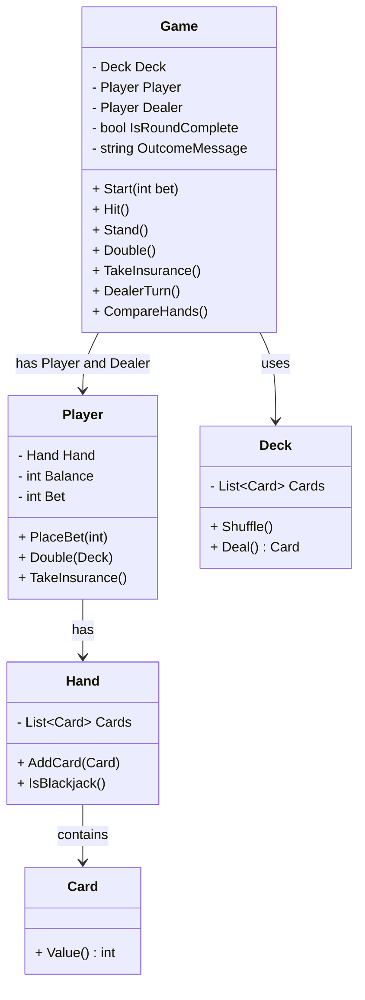
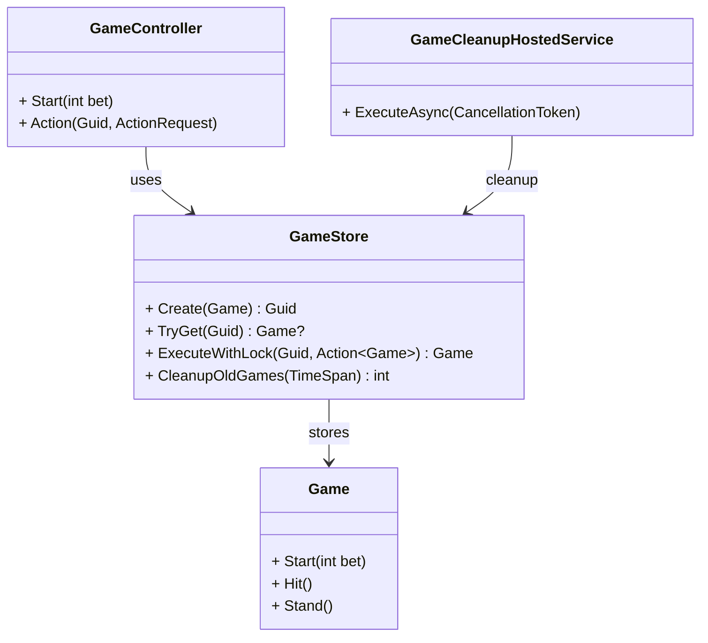

# Blackjack Class Diagrams

This document illustrates the domain logic and API infrastructure layer for the Blackjack project.

## 1. Domain Class Diagram (Core Engine)

## 2. API & Infrastructure Diagram (Runtime Layer)

### Architecture Notes

- **GameStore**: Registered as a singleton in dependency injection to manage active game sessions in memory.
- **Concurrency**: ExecuteWithLock acquires per-game lock instances to prevent race conditions during concurrent player actions.
- **Background Processing**: GameCleanupHostedService runs as a periodic background service to invoke CleanupOldGames(...) and drop inactive sessions.
