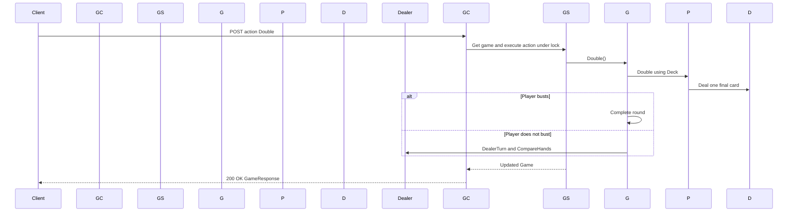

# Double Action Sequence Diagram

```mermaid
sequenceDiagram
participant Client
participant GameController as GC
participant GameStore as GS
participant Game as G
participant Player as P
participant Deck as D
participant Dealer

Client->>GC: POST action Double
GC->>GS: Get game and execute action under lock
GS->>G: Double()
G->>P: Double using Deck
P->>D: Deal one final card
alt Player busts
  G->>G: Complete round
else Player does not bust
  G->>Dealer: DealerTurn and CompareHands
end
GS-->>GC: Updated Game
GC-->>Client: 200 OK GameResponse
```
