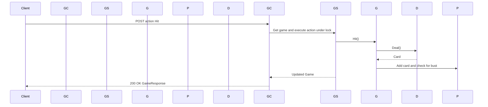

# Hit Action Sequence Diagram

```mermaid
sequenceDiagram
participant Client
participant GameController as GC
participant GameStore as GS
participant Game as G
participant Player as P
participant Deck as D

Client->>GC: POST action Hit
GC->>GS: Get game and execute action under lock
GS->>G: Hit()
G->>D: Deal()
D-->>G: Card
G->>P: Add card and check for bust
GS-->>GC: Updated Game
GC-->>Client: 200 OK GameResponse
```
