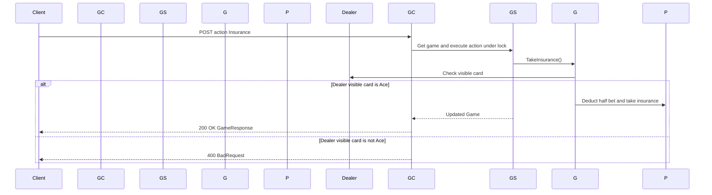

# Insurance Action Sequence Diagram

```mermaid
sequenceDiagram
participant Client
participant GameController as GC
participant GameStore as GS
participant Game as G
participant Player as P
participant Dealer

Client->>GC: POST action Insurance
GC->>GS: Get game and execute action under lock
GS->>G: TakeInsurance()
G->>Dealer: Check visible card
alt Dealer visible card is Ace
  G->>P: Deduct half bet and take insurance
  GS-->>GC: Updated Game
  GC-->>Client: 200 OK GameResponse
else Dealer visible card is not Ace
  GC-->>Client: 400 BadRequest
end
```
