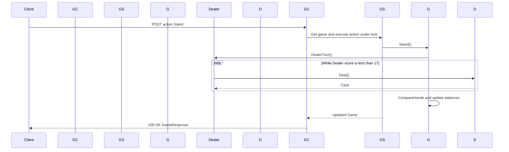

# Stand Action Sequence Diagram

```mermaid
sequenceDiagram
participant Client
participant GameController as GC
participant GameStore as GS
participant Game as G
participant Dealer
participant Deck as D

Client->>GC: POST action Stand
GC->>GS: Get game and execute action under lock
GS->>G: Stand()
G->>Dealer: DealerTurn()
loop While Dealer score is less than 17
  Dealer->>D: Deal()
  D-->>Dealer: Card
end
G->>G: CompareHands and update balances
GS-->>GC: Updated Game
GC-->>Client: 200 OK GameResponse
```
