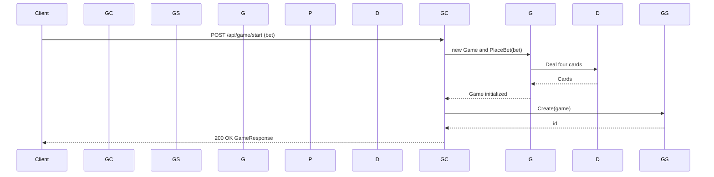

# Start Game Sequence Diagram

```mermaid
sequenceDiagram
participant Client
participant GameController as GC
participant GameStore as GS
participant Game as G
participant Player as P
participant Deck as D

Client->>GC: POST /api/game/start (bet)
GC->>G: new Game and PlaceBet(bet)
G->>D: Deal four cards
D-->>G: Cards
G-->>GC: Game initialized
GC->>GS: Create(game)
GS-->>GC: id
GC-->>Client: 200 OK GameResponse
```
